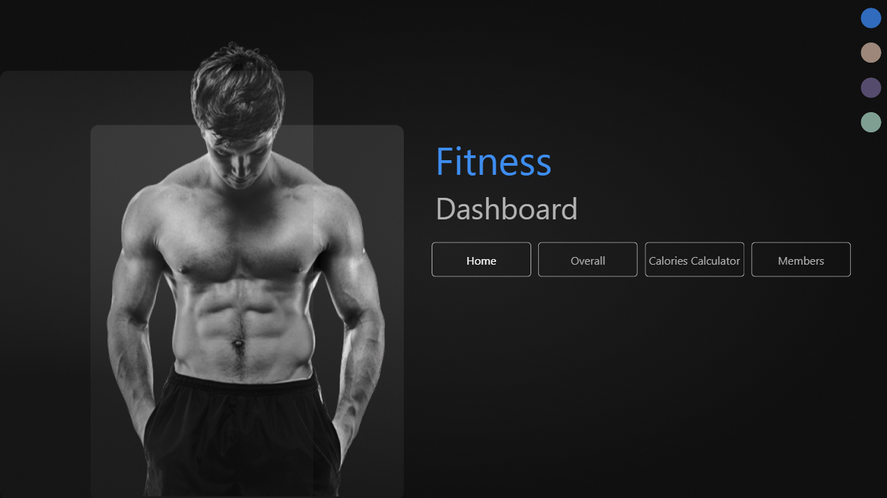
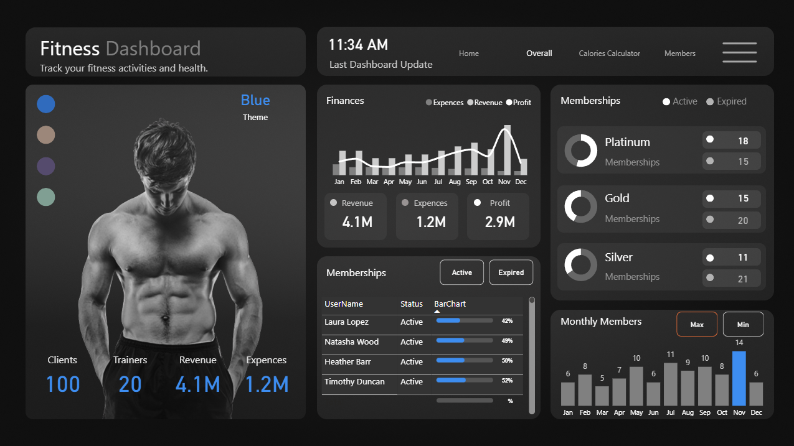

# 🏋️‍♂️ Fitness Dashboard 

An advanced **Fitness Tracking Dashboard** built using **Power BI**, designed to analyze and visualize fitness-related data including **BMI, calorie tracking, revenue, members, and trainers**.  
This dashboard provides interactive insights for **clients, trainers, and gym admins** with features like **color theme switcher, calorie calculator, and membership analysis**.

---

## 📌 Features

- 🎨 **Theme Switcher** – 4 different color themes to customize the dashboard.  
- ⏰ **Live Time Update** – Displays the latest dashboard update time.  
- 🧮 **Calorie Calculator** – Calculates BMR, TDEE, maintenance calories, and weight-loss targets.  
- 📊 **Overview & Analytics** – Track revenue, expenses, profits, and membership stats.  
- 👥 **Member Insights** – Detailed member breakdown by age, gender, status, and goals.  
- 🏋️ **Trainer & Client Data** – Track clients, trainers, and financials.  
- 📈 **Interactive Visuals** – Dynamic charts, bar graphs, and donut charts for better insights.  

---

## 📂 Dashboard Pages

1. **Home Page**
   - Clean landing page with navigation.
   - Quick access to Home, Overall, Calories Calculator, and Members sections.

2. **Calories Calculator Page**
   - Calculates **BMI** with gauge chart.  
   - User input: Age, Height, Weight, and Activity Type.  
   - Results: BMR, TDEE, Maintenance Calories, and Weight Loss Goals.  

3. **Members Details Page**
   - Member breakdown by **Age, Gender, and Status**.  
   - Detailed **Member Information Table** (username, gender, join date, goal, BMI).  
   - Active vs Expired members comparison.  

4. **Overview Page**
   - **Financial Performance:** Revenue, Expenses, and Profit trends.  
   - **Membership Distribution:** Platinum, Gold, Silver.  
   - **Monthly Member Tracking** – Max & Min members by month.  
  

---

## 📸 Screenshots

### Home Page

### Calories Calculator

### Members Details

### Overview

---

## 📊 Tech Stack

- **Tool:** Power BI  
- **Data Source:** Fitness-related sample dataset  
- **Visuals Used:** Gauge Charts, Bar Charts, Donut Charts, Line Charts, Cards, Tables  

---

## 📌 Author

👤 **Sameer Prajapati**  
  
   

---

## ⭐ Feedback

If you like this dashboard, don’t forget to **star ⭐ this repository** and share your feedback!
